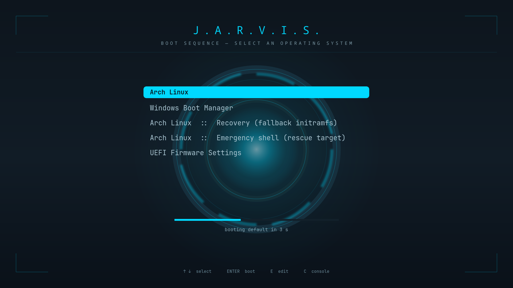

# J.A.R.V.I.S. — GRUB Theme

An arc-reactor boot menu for GRUB2. Deep blue-black, cyan HUD, monospaced.



---

## Install

```bash
git clone https://github.com/sarbojitrana/jarvis-grub-theme.git
cd jarvis-grub-theme
sudo ./install.sh
```

Reboot to see it.

Have a look first if you'd rather:

```bash
sudo ./install.sh --dry-run
```

## Uninstall

```bash
sudo ./install.sh --uninstall
```

This restores the `/etc/default/grub` that was backed up at install time and
regenerates `grub.cfg`.

---

## What the installer actually does

Editing a bootloader deserves some care, so the script is deliberate about it:

1. **Detects your layout.** `grub.cfg` lives in `/boot/grub` on Arch and Debian
   but `/boot/grub2` on Fedora and openSUSE, and the generator is either
   `grub-mkconfig` or `grub2-mkconfig`. Both are probed rather than assumed.
2. **Backs up** `grub.cfg` and `/etc/default/grub` to
   `/root/jarvis-grub-backup-<timestamp>/`.
3. **Copies** the theme to `/usr/share/grub/themes/jarvis` and points
   `GRUB_THEME` at it. That path is on the root filesystem, which GRUB reads
   directly. Pass `--boot-themes` to install under `/boot/grub/themes` instead —
   needed only if GRUB can't read `/usr` (separate encrypted partition, say).
   Note that on UEFI systems `/boot` is often a small FAT ESP and this theme is
   ~2.4 MB, so the default is usually what you want.
4. **Un-sets `GRUB_TERMINAL_OUTPUT=console`** if present — a graphical theme
   cannot render on a text terminal, and this is the single most common reason
   a GRUB theme silently does nothing.
5. **Regenerates `grub.cfg`, then verifies it.** Before regenerating it records
   whether your old config used Unified Kernel Images (`uki` / `15_uki`) and
   whether it sourced `custom.cfg`, and counts the menu entries. If any of those
   are missing afterwards, or entries were lost, **it restores the backup and
   exits non-zero**. Your boot config is never left in a worse state than it
   started.

Pass `--no-regen` if you manage `grub.cfg` yourself.

| Flag | Effect |
|---|---|
| `--dry-run` | print every step, change nothing |
| `--no-regen` | install but leave `grub.cfg` alone |
| `--boot-themes` | install under `/boot/grub/themes` |
| `--uninstall` | remove and restore the previous config |

---

## Requirements

- GRUB 2 with a graphical terminal (`gfxterm`) — the default nearly everywhere
- Nothing else. Fonts are pre-built; ImageMagick is only needed if you want to
  re-render the background

---

## Customising

### Colours

The palette is defined in two places:

| What | Where |
|---|---|
| Menu text, selected item, countdown, hints | `theme/theme.txt` |
| Background and reactor | `tools/background.svg` |

Edit the SVG, then:

```bash
./tools/build-background.sh
```

The accent is `#00d9ff` throughout. `desktop-color` in `theme.txt` should match
the SVG's base (`#0d151d`) so there is no seam if the image fails to load.

### Fonts

GRUB can't read TTFs — `grub-mkfont` bakes a bitmap at a fixed size and stores a
name *inside* the `.pf2`. `theme.txt` must reference that exact name, which is
why the entries read `"JetBrainsMono NF Regular 20"` and not a file path.

To swap fonts:

```bash
./tools/build-fonts.sh /path/to/Regular.ttf /path/to/Bold.ttf
```

It prints the baked-in names at the end — copy them into `theme.txt`.

### Resolution

`background.png` is 1920×1080. GRUB scales it to the screen, and the layout is
expressed in percentages, so other 16:9 resolutions work as-is. For a very
different aspect ratio, edit the `viewBox` in `tools/background.svg` and
re-render.

### Menu size and position

In `theme.txt`, under `+ boot_menu`:

```
left   = 28%
top    = 30%
width  = 44%
height = 42%
```

`item_height` must stay ≥ the height of `select_*.png` (44px) or the selection
pill gets clipped.

---

## Layout of this repo

```
theme/                 what gets installed
  theme.txt            GRUB gfxmenu definition
  background.png       1920x1080 backdrop
  *.pf2                pre-built bitmap fonts
  select_*.png         selection pill, sliced west / centre / east
  progress_*.png       countdown bar
  terminal_box_*.png   frame for the GRUB console (press C)
tools/
  background.svg       source art for background.png
  build-background.sh  re-render the backdrop
  build-fonts.sh       rebuild the .pf2 fonts from a TTF
install.sh             installer / uninstaller
```

---

## Troubleshooting

**The theme doesn't appear.** Almost always `GRUB_TERMINAL_OUTPUT=console` in
`/etc/default/grub` — the installer comments it out, but check it stayed that
way. Confirm `grub.cfg` contains `set theme=`.

**Text is missing or boxes render instead of glyphs.** A font name in
`theme.txt` doesn't match the name inside the `.pf2`. Run
`./tools/build-fonts.sh` and copy the names it prints.

**Menu entries vanished after install.** They shouldn't — the installer verifies
the count and rolls back if it drops. If you hit this anyway, your previous
config is in `/root/jarvis-grub-backup-<timestamp>/`.

---

## License

MIT — see [LICENSE](LICENSE).

Fonts are built from [JetBrains Mono](https://github.com/JetBrains/JetBrainsMono)
(SIL Open Font License 1.1), patched by
[Nerd Fonts](https://github.com/ryanoasis/nerd-fonts).
