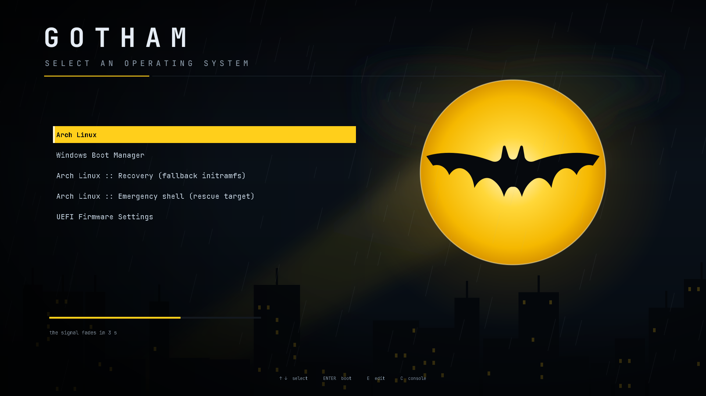
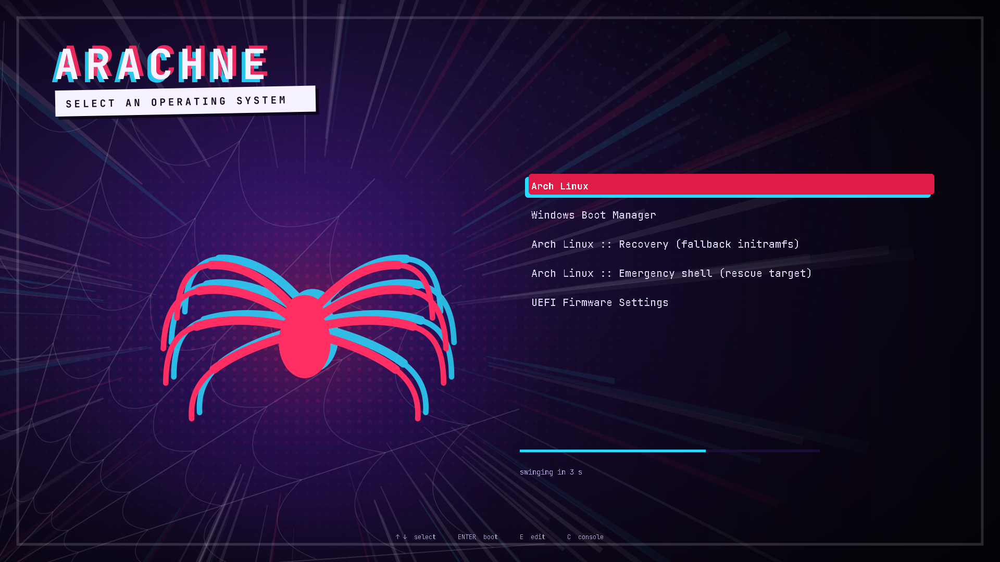

# grub-themes

A collection of GRUB2 boot themes, and an application to browse them and apply
one safely.

[](https://github.com/sarbojitrana/grub-themes/actions/workflows/ci.yml)


Changing your GRUB theme normally means copying files into
`/usr/share/grub/themes`, hand-editing `/etc/default/grub`, and hoping
`grub-mkconfig` does not quietly drop a boot entry. This does it for you — and
checks afterwards that your boot configuration survived.

```bash
grub-themes            # browse the themes, press enter to apply one
```

---

## Install

```bash
git clone https://github.com/sarbojitrana/grub-themes.git
cd grub-themes
./install.sh              # into /usr/local, asks for sudo
./install.sh --user       # into ~/.local, no root needed
```

That installs the binary, the themes, and a desktop entry — so **GRUB Themes**
appears in rofi, wofi, or your application menu straight away. Nothing about
your bootloader changes until you apply a theme from inside the app.

<details>
<summary>Arch, Debian/Ubuntu, Fedora, or just the binary</summary>

```bash
# Arch
makepkg -si -p packaging/PKGBUILD

# .deb / .rpm (needs nfpm)
make build VERSION=1.0.0
nfpm package -f packaging/nfpm.yaml -p deb -t dist/
nfpm package -f packaging/nfpm.yaml -p rpm -t dist/

# just the binary, no desktop entry
go build -o grub-themes ./cmd/grub-themes
```

The binary is static and has no runtime dependencies. GRUB itself is only
needed to *apply* a theme; browsing, linting and previewing work anywhere,
including over SSH.
</details>

## Use

The browser is the main way in:

```
 GRUB THEMES  3 available                              ● jarvis is applied
   arachne      Arachne              │  ┌────────────────────────────────┐
   gotham       Gotham               │  │                                │
 ▸ jarvis       J.A.R.V.I.S.       ● │  │   a live preview of the theme  │
                                     │  │   drawn in the terminal        │
                                     │  └────────────────────────────────┘
                                     │  J.A.R.V.I.S.  ● applied
                                     │  Arc-reactor HUD in cyan on blue-black.
                                     │  Sarbojit Rana · v1.1.0 · MIT · 1920x1080
 ↑↓ move · enter apply · r remove · l lint · p open preview · n build your own · q quit
```

Everything it does is also a subcommand, because half of this gets used over
SSH and in CI:

| Command | What it does |
|---|---|
| `grub-themes` | browse and apply |
| `grub-themes list` | what is available |
| `grub-themes status` | what GRUB is configured to use right now |
| `grub-themes apply ID` | install it and regenerate `grub.cfg` (needs root) |
| `grub-themes apply ID --dry-run` | print every step, change nothing |
| `grub-themes remove` | put GRUB back the way it was |
| `grub-themes new ID` | scaffold a theme of your own |
| `grub-themes build ID` | generate a theme's assets from its manifest |
| `grub-themes lint ID` | validate — no GRUB, no reboot needed |
| `grub-themes preview ID` | render `theme.txt` to a PNG |

## Themes

| | |
|---|---|
| **[J.A.R.V.I.S.](themes/jarvis)** — arc-reactor HUD in cyan on blue-black |  |
| **[Gotham](themes/gotham)** — a bat-signal over a sleeping city, in black, rain and signal yellow |  |
| **[Arachne](themes/arachne)** — comic multiverse: halftone dots, speed lines and a spider printed out of register |  |

Every theme here is original vector artwork, drawn for this repository.

## Build your own

```bash
grub-themes new mytheme     # a complete, working theme in one command
```

It scaffolds into `~/.local/share/grub-themes/themes`, builds it, and it shows
up in the browser immediately — so you can keep a theme entirely to yourself,
on your own machine, and never publish anything.

Colours and shapes come from a small manifest, and the application generates
every PNG and font from it:

```toml
[assets.selection]
style  = "pill"      # pill | bar | underline | none
fill   = "#00d9ff"
text   = "#05202a"
radius = 10
```

The art is a single SVG you edit however you like. Then:

```bash
grub-themes build mytheme     # render the SVG, draw the pixmaps, bake the fonts
grub-themes lint mytheme      # catch the silent failures
grub-themes preview mytheme   # look at it, no reboot
grub-themes apply mytheme     # use it
```

**[docs/build-your-own-theme.md](docs/build-your-own-theme.md)** is the full
guide. If you would like your theme in the collection, it is one directory copy
and a pull request — see [CONTRIBUTING.md](CONTRIBUTING.md).

## Why the application is careful

GRUB gives almost no feedback. It drops what it cannot read and carries on
booting, so a broken theme looks like a broken *menu*, not a broken file. Three
examples this project has already hit in practice:

- A pixmap saved as a palette PNG is silently ignored. The selected entry then
  looks *blanked out* rather than highlighted, because only its text colour
  changed.
- A font is matched by a name baked inside the `.pf2` file, not by filename.
  Rename it and the text disappears.
- `GRUB_TERMINAL_OUTPUT=console` disables graphics entirely, so no theme
  renders at all — the most common reason a GRUB theme "does nothing".

`grub-themes lint` catches all of these before you reboot, and `grub-themes
build` makes the first one impossible to create in the first place.

Applying a theme backs up `grub.cfg` and `/etc/default/grub` to
`/var/lib/grub-themes/backups/`, then verifies that your UKI entries, your
`custom.cfg` include and your menu entry count all survived regeneration —
restoring the backup and failing loudly if they did not. Someone else's
recovery entry must not vanish because they tried a theme.

## Contributing

Themes, code, docs and bug reports are all welcome, and you do not need GRUB
installed or a reboot to contribute — `lint` and `preview` run anywhere. CI
runs them on every pull request and attaches the rendered preview, so a theme
can be reviewed without booting anything.

**Signed commits are required.** See [CONTRIBUTING.md](CONTRIBUTING.md), and
[AGENTS.md](AGENTS.md) for the architecture and the constraints behind the
odd-looking decisions.

This repository takes part in **Hacktoberfest**.

## License

MIT — see [LICENSE](LICENSE). The themes ship bitmap fonts built with
`grub-mkfont` from [JetBrains Mono](https://github.com/JetBrains/JetBrainsMono)
(SIL OFL 1.1), patched by [Nerd Fonts](https://github.com/ryanoasis/nerd-fonts).
